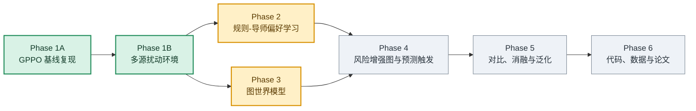
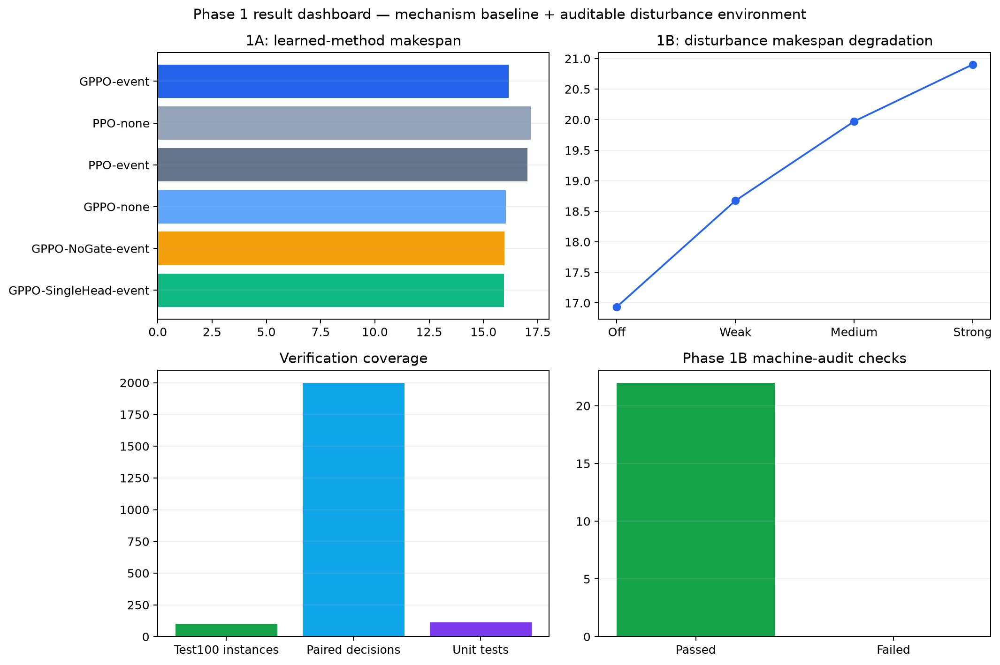
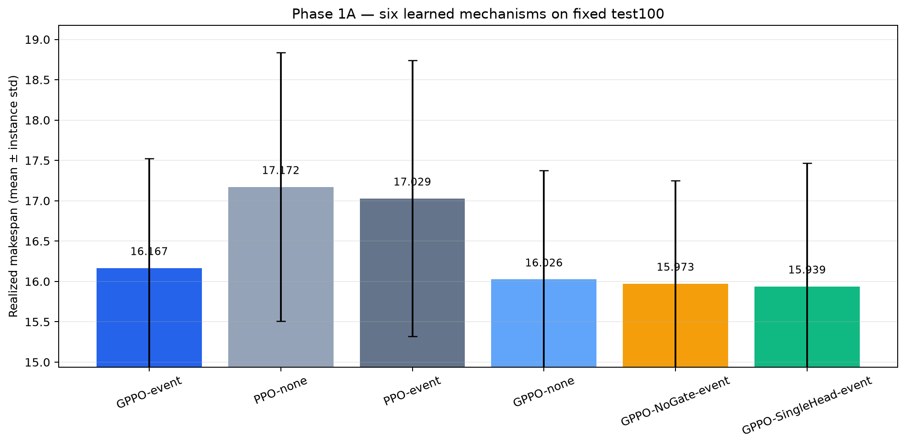
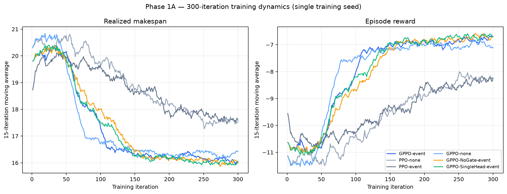
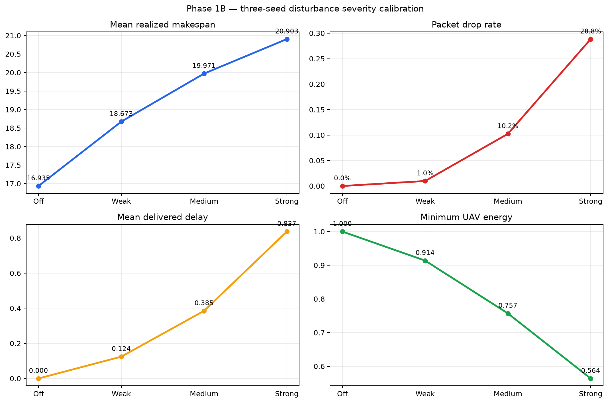
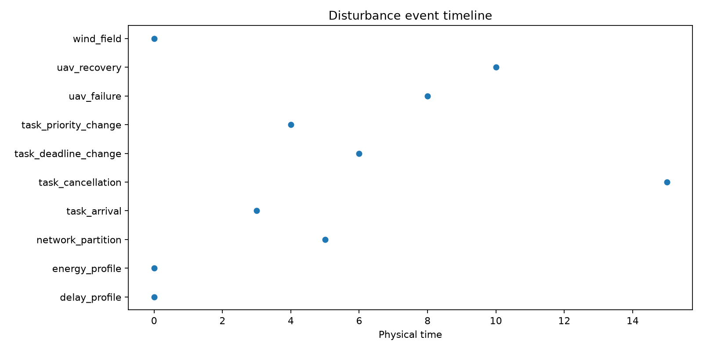
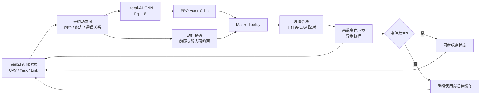
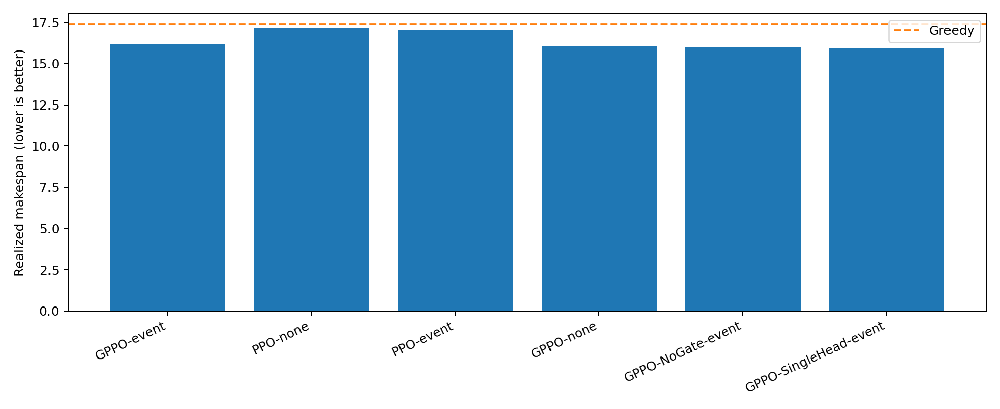
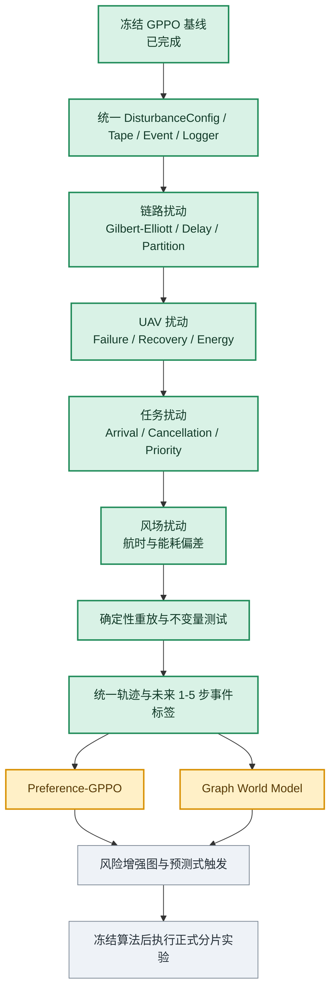
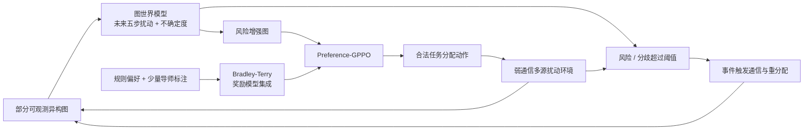

# 弱通信多无人机动态任务分配：GPPO 机制复现与预测偏好决策路线

[](https://www.python.org/)
[](https://pytorch.org/)


本项目研究**弱通信和多源扰动条件下，异构无人机集群的动态任务分配**。当前分支首先复现论文 *Multi-UAV Dynamic Task Assignment Based on Event-Triggered Graph Reinforcement Learning Under Weak Communication* 中的异构任务图、AHGNN、动作掩码、事件触发通信和 GPPO，再逐步扩展到多源扰动、偏好奖励和图世界模型。

> 原论文未公开完整环境、实例生成器、训练代码和随机细节。本仓库提供的是**可审计的机制级/结构级复现**，不宣称原论文数值级复现。

## 项目现在做到哪里



| 阶段 | 状态 | 当前结论 |
|---|---|---|
| Phase 1A：GPPO 基线 | **已冻结，带局限完成** | 六模型 300 轮机制验证、候选重评估、Gate 诊断和三种子筛选均已完成 |
| Phase 1B：多源扰动 | **已完成并通过机器审计** | 通信、UAV/能量、动态任务和风场扰动均可配置、重放和审计；最终审计 `valid=true` |
| Phase 2：偏好强化学习 | 设计阶段 | 不在当前“无偏好”分支中；不能把标量奖励简单乘偏好权重 |
| Phase 3：图世界模型 | 设计阶段 | 固定 event tape 只用于公平比较，不能冒充 learned world model |
| Phase 4：预测触发 | 未开始 | 依赖扰动标签、模型校准与不确定度 |
| Phase 5：正式实验 | 暂缓全量执行 | 后续长时训练放到 Colab，并在算法冻结后分片运行 |

完整的阶段判断见 [`docs/STAGE1_TRANSITION_ARCHIVE_2026-08-10.md`](docs/STAGE1_TRANSITION_ARCHIVE_2026-08-10.md)，机器可读决策见 [`configs/STAGE1_TRANSITION_DECISION_2026-08-10.json`](configs/STAGE1_TRANSITION_DECISION_2026-08-10.json)。

## 第一阶段成果总览与图片

第一阶段由两部分组成：Phase 1A 完成 GPPO 机制基线、六模型对比和 Gate 筛选；Phase 1B 完成可配置、可重放、可审计的多源扰动环境与标准轨迹。下面所有图片及其原始 JSON/训练历史均已同步到本分支。



### Phase 1A：计算结果与训练过程

| 图表 | 展示内容 | 原始证据 |
|---|---|---|
| [六模型 test100 对比](deliverables/stage1_gallery/phase1a_method_comparison.png) | 六种学习机制的 realized makespan 均值与实例标准差 | [机制验收 JSON](artifacts/phase1_seed1_300/raw/MECHANISM_ACCEPTANCE.json) |
| [配对差值与 95% CI](deliverables/stage1_gallery/phase1a_pairwise_effects.png) | GPPO/PPO、通信模式和 Adaptive 消融的实例级配对差值 | [机制验收 JSON](artifacts/phase1_seed1_300/raw/MECHANISM_ACCEPTANCE.json) |
| [300 轮训练曲线](deliverables/stage1_gallery/phase1a_training_curves.png) | 六模型 makespan 与 reward 的 15 轮移动平均 | [六模型训练目录](artifacts/phase1_seed1_300/raw/T5-10-48) |
| [通信成本—任务质量](deliverables/stage1_gallery/phase1a_communication_tradeoff.png) | Event/None/Full 的通信字节与 makespan 权衡 | [机制验收 JSON](artifacts/phase1_seed1_300/raw/MECHANISM_ACCEPTANCE.json) |
| [三种子 Gate 筛选](deliverables/stage1_gallery/phase1a_gate_screening.png) | 七个候选结构在 validation-A 上的预注册排序 | [Gate 筛选报告](reports/GATE_THREE_SEED_SCREENING.md) |
| [原始六模型箱线图](artifacts/phase1_seed1_300/raw/mechanism_makespan.png) | fixed test100 的 makespan 分布 | [第一阶段产物目录](artifacts/phase1_seed1_300) |
| [Leader 故障探针](artifacts/phase1_seed1_300/raw/leader_failure_makespan.png) | Leader 故障、任务释放和恢复后的 makespan | [故障探针 JSON](artifacts/phase1_seed1_300/raw/leader_failure_probe.json) |





### Phase 1B：多源扰动与数据可视化

| 图表 | 展示内容 | 原始证据 |
|---|---|---|
| [扰动强度校准](deliverables/stage1_gallery/phase1b_severity_calibration.png) | Off/Weak/Medium/Strong 的 makespan、丢包、时延和最低能量 | [校准 JSON](deliverables/phase1b/calibration.json) |
| [事件时间线](deliverables/phase1b/event_timeline.png) | 通信、故障、恢复、任务与风场事件的物理时间 | [Disturbance tape](deliverables/phase1b/sample_tape.json) |
| [链路状态](deliverables/phase1b/link_state.png) | Gilbert–Elliott 链路丢包概率随时间变化 | [Disturbance tape](deliverables/phase1b/sample_tape.json) |
| [UAV 能量曲线](deliverables/phase1b/uav_energy.png) | 多 UAV 在执行、待机与通信过程中的能量衰减 | [标准轨迹（gzip）](deliverables/phase1b/sample_trajectory.json.gz) |
| [任务变化甘特图](deliverables/phase1b/task_gantt.png) | 动态新增、取消、优先级和 deadline 变化 | [标准轨迹（gzip）](deliverables/phase1b/sample_trajectory.json.gz) |





完整索引见 [`deliverables/stage1_gallery/GALLERY_MANIFEST.json`](deliverables/stage1_gallery/GALLERY_MANIFEST.json)。Phase 1B 的中文校准报告、机器审计和 test100 全关闭等价证据分别见：

- [`DISTURBANCE_CALIBRATION.md`](deliverables/phase1b/DISTURBANCE_CALIBRATION.md)
- [`DISTURBANCE_IMPLEMENTATION_AUDIT.json`](deliverables/phase1b/DISTURBANCE_IMPLEMENTATION_AUDIT.json)
- [`ALL_OFF_EQUIVALENCE_TEST100.json`](deliverables/phase1b/ALL_OFF_EQUIVALENCE_TEST100.json)

## 当前 GPPO 基线在做什么



已实现的关键机制：

- 任务/子任务两层结构、DAG 前序约束、异构 UAV 能力与异步执行；
- Literal-AHGNN Eq.(1)–(5)，self 使用独立 `W^T v_k`；
- self 与 task neighbors 共享 attention softmax 域；
- expected-RReLU 正式默认；
- Adaptive、NoGate、SingleHead 和 PPO-MLP 模式；
- `none/event/periodic/always` 通信模式；
- belief mask 与 true mask 分离审计，环境非法动作计数；
- 固定 train/validation/test instance bank 与 event tape；
- 候选 checkpoint、完整续训状态、哈希和恢复审计。

模型的冻结定义见 [`docs/PHASE1_MODEL_DEFINITIONS.md`](docs/PHASE1_MODEL_DEFINITIONS.md)，正式协议见 [`configs/PHASE1_FROZEN_PROTOCOL.json`](configs/PHASE1_FROZEN_PROTOCOL.json)。

## 300 轮机制验证：已经证明什么

实验范围为 `T5-10-48 / training seed 1 / 300 iterations / fixed test100`。六种学习方法使用相同测试实例和 event tape。

| 方法 | realized makespan mean | median | completion |
|---|---:|---:|---:|
| GPPO-event | 16.1673 | 16.0369 | 1.0000 |
| PPO-none | 17.1720 | 17.1472 | 1.0000 |
| PPO-event | 17.0290 | 16.7780 | 1.0000 |
| GPPO-none | 16.0260 | 15.9242 | 1.0000 |
| GPPO-NoGate-event | 15.9732 | 15.8206 | 1.0000 |
| GPPO-SingleHead-event | 15.9389 | 15.8049 | 1.0000 |



对照结果：

- Random makespan：`20.4073`；
- Greedy makespan：`17.3752`；
- GPPO-event 相对 PPO-none：`-1.0046`，实例级 95% CI `[-1.3246, -0.6847]`；
- GPPO-event 相对 PPO-event：`-0.8617`，实例级 95% CI `[-1.1529, -0.5706]`；
- 同 checkpoint 的 Event/Full makespan 均为 `16.1673`；
- Event 相对 Full 通信字节减少约 `99.93%`；
- 所有审计实例均完成任务，动作掩码违规和环境非法动作均为 `0`。

这些结果支持：**GPPO 主体机制、异构图、动作掩码和事件通信链路能够按当前协议运行**。权威结果与哈希见 [`artifacts/phase1_seed1_300`](artifacts/phase1_seed1_300)。

### 必须保留的 Adaptive 负结果

原始 task-message Adaptive 并未在单种子 300 轮中优于简单结构：

- Adaptive − NoGate makespan：`+0.1942`，95% CI `[+0.0061, +0.3823]`；
- Adaptive − SingleHead makespan：`+0.2284`，95% CI `[+0.0317, +0.4251]`。

正值表示 Adaptive 更差。Gate 分布、策略敏感度和 PPO probe 梯度表明 gate 并非常数、也不是完全无梯度，因此该负结果不能通过“gate 没有参与训练”简单解释。

进一步完成了七变体、三训练种子、每种 300 轮的预注册筛选。只使用 validation-A 选模后，`Adaptive-score` 以 `15.9025` 的平均 makespan 获得 `GPPO-Best` 资格；NoGate 和 SingleHead 分别为 `15.9805` 和 `15.9613`。这只是正式实验的晋级依据，**仍不是四规模五种子的最终统计结论**。详见 [`reports/GATE_THREE_SEED_SCREENING.md`](reports/GATE_THREE_SEED_SCREENING.md)。

## 结果边界

当前证据可以说明：

- GPPO 基线链路和论文关键机制已经实现；
- 单规模、单训练种子下 GPPO 相对 PPO/Random 呈现正向结果；
- Event 通信可在同 checkpoint 重放中保持质量并显著减少字节；
- Adaptive 的原始实现存在真实、可复核的负结果；
- `Adaptive-score` 已通过三种子 validation-only 筛选，可以进入正式验证。

当前证据不能说明：

- GPPO 已在五训练种子上稳定优于 PPO 或 Greedy；
- Adaptive 已在四种规模上稳定优于 NoGate/SingleHead；
- Preference-GPPO 或图世界模型已经完成；
- 实现复现了原论文公开数值；
- 实例级置信区间可以替代训练种子级置信区间。

## Phase 1B：多源扰动环境已完成

Phase 1B 已以独立、可关闭、可序列化、可哈希、可重放的 disturbance tape 接入冻结基线。全扰动关闭时，在固定 T5 test100 的 2,000 个配对决策上，观测、动作掩码、奖励、基础事件带、真实状态和指标完全一致。



已完成内容：

1. **统一接口**：实现 `DisturbanceConfig`、`DisturbanceTape`、不可变 `DisturbanceEvent` 和 `DisturbanceLogger`；
2. **通信扰动**：Gilbert-Elliott Good/Bad 链、逐包丢失、消息到达队列、网络分区和恢复同步；
3. **UAV 扰动**：永久/临时故障、能量扣减、低能量退化、任务释放与 leader 接替；
4. **任务扰动**：任务新增、取消、优先级和 deadline 变化，并保持 DAG 合法；
5. **风场扰动**：空间风向/风速、航向相关航时和能耗偏差；
6. **可审计测试**：固定 seed 生成字节一致的 tape，检查事件覆盖、缓存语义、动作合法性、能量边界和任务恢复；
7. **轨迹标准化**：输出 partial graph、action、mask、communication history、未来五步事件标签、objective vector 和 terminal metrics。

接口协议见 [`configs/DISTURBANCE_INTERFACE_PROTOCOL.json`](configs/DISTURBANCE_INTERFACE_PROTOCOL.json)，最终校准与审计见 [`deliverables/phase1b`](deliverables/phase1b)。这些结果证明环境和数据基础设施完成，不代表 Preference-GPPO 或 learned world model 已经有效。

## 后续“预测—偏好—决策”闭环

在已稳定的多源扰动环境上，后续将形成以下闭环：



Preference-GPPO 不应实现为“标量奖励 × 偏好权重”。计划使用任务成功、截止期、makespan、能耗、通信量、重分配次数和方案稳定性等向量指标，构造规则—导师混合偏好对，再训练 Bradley-Terry 奖励模型。

世界模型必须接受独立的 observation/action/history 监督，报告 AUROC/F1、RMSE、Brier、校准误差、提前量和误触发成本。固定 event tape 只服务于公平比较。

文献与实现边界审计见 [`docs/PCRL_JEPA_LITERATURE_AUDIT.md`](docs/PCRL_JEPA_LITERATURE_AUDIT.md)。

## 运行、测试与复核

### 安装

```bash
python -m pip install -r requirements.txt
python -m pip install -e .
```

### 测试

```bash
python -m pytest -q
```

### 单模型训练示例

```bash
python train_paper_faithful.py \
  --mode literal \
  --sync-mode event \
  --scale T5-10-48 \
  --seed 1 \
  --iterations 300 \
  --rollout-steps 512 \
  --batch-size 512 \
  --update-epochs 4 \
  --validation-interval 50 \
  --validation-instances 100 \
  --validation-split validation_a \
  --output outputs/example/literal_event_seed1
```

### 固定 test100

```bash
python evaluate_paper_faithful.py \
  --checkpoint outputs/example/literal_event_seed1/checkpoint.pt \
  --instances 100 \
  --split test \
  --trace \
  --output outputs/example/literal_event_seed1/test100.json
```

### Google Colab

- 单规模机制验证：[`colab/GPPO_Mechanism_Validation_Colab.ipynb`](colab/GPPO_Mechanism_Validation_Colab.ipynb)
- Phase-1 正式完整流水线：[`colab/GPPO_Phase1_Full_Colab.ipynb`](colab/GPPO_Phase1_Full_Colab.ipynb)
- [直接在 Colab 打开正式完整流水线](https://colab.research.google.com/github/Battleplus/GPPO/blob/8.8-GPPO%E6%97%A0%E5%81%8F%E5%A5%BD/colab/GPPO_Phase1_Full_Colab.ipynb)

> **计算成本提示：**正式完整流水线最多包含 135 个训练任务 × 2000 iterations，即 270,000 iterations，约 1.38 亿 rollout transitions，另有 validation/test。它用于最终论文统计，不是当前进入多源扰动、PCRL 或世界模型开发的前置任务。建议在算法冻结后按规模和种子拆成多个 Colab 分片执行。

## 仓库导航

| 路径 | 内容 |
|---|---|
| `src/uav_assignment/` | 环境、图编码器、策略和训练核心 |
| `tests/` | 公式、环境、掩码、恢复、CUDA和审计测试 |
| `configs/` | 冻结协议、Gate筛选和扰动接口预注册 |
| `artifacts/phase1_seed1_300/` | 六模型300轮权威机制证据 |
| `reports/` | Gate、候选checkpoint和公式审计报告 |
| `docs/` | 阶段状态、模型定义、矛盾诊断和文献审计 |
| `colab/` | Colab训练、恢复、监控和正式矩阵入口 |

## 复现原则

1. 不使用 test/test100 选择 checkpoint、结构或超参数；
2. 不删除或覆盖 Adaptive 和 Hard Dynamic Extension 的历史负结果；
3. 不把单训练种子的实例级 CI 写成训练种子稳定性；
4. 不把固定事件带写成 learned world model；
5. 不在算法仍会修改时提前消耗完整正式矩阵；
6. 所有正式结果保留配置、种子、checkpoint 哈希、实例库和事件带证据；
7. 只有冻结算法后的多种子对比、消融和泛化实验才能支持最终论文结论。

---

当前最优先任务：**基于 Phase 1B 标准轨迹推进 Preference-GPPO 与图世界模型；长时间训练放到 Colab，不重复已有六模型 100/300 轮机制实验。**
