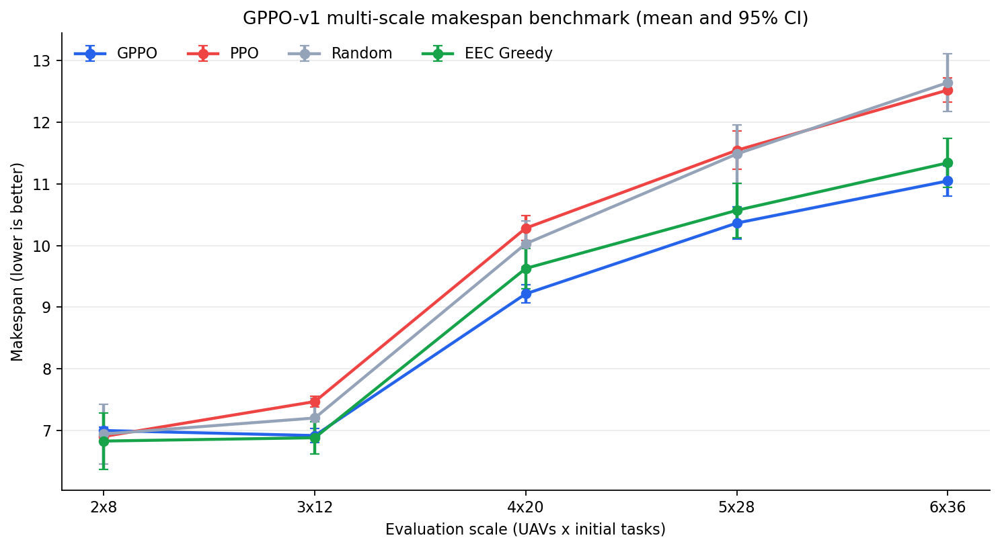
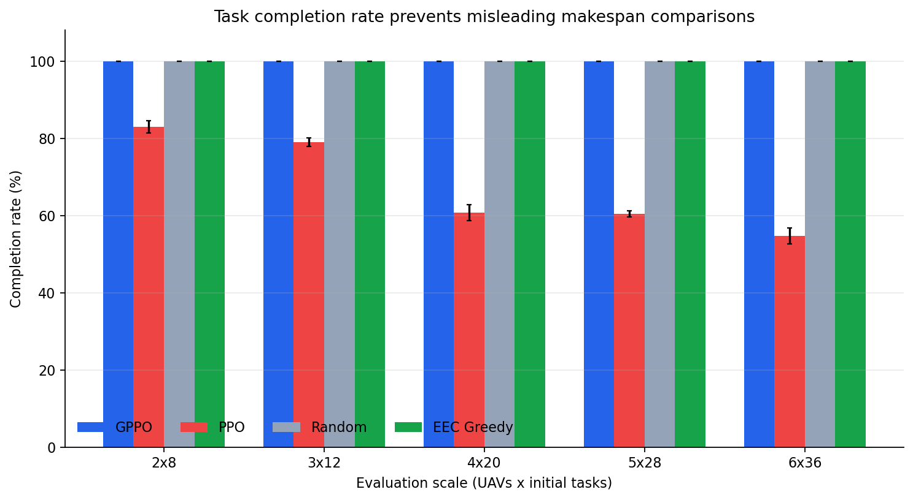
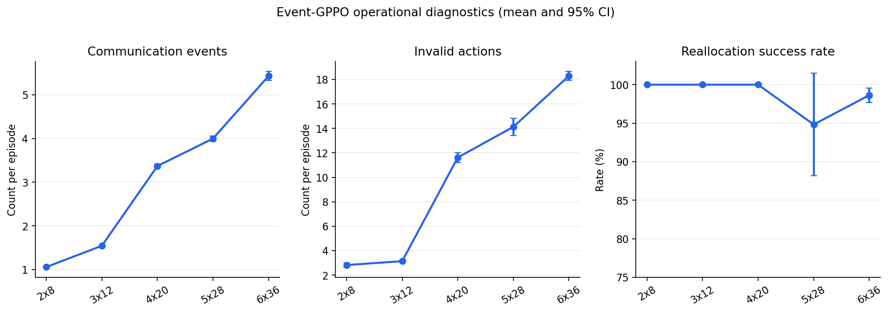
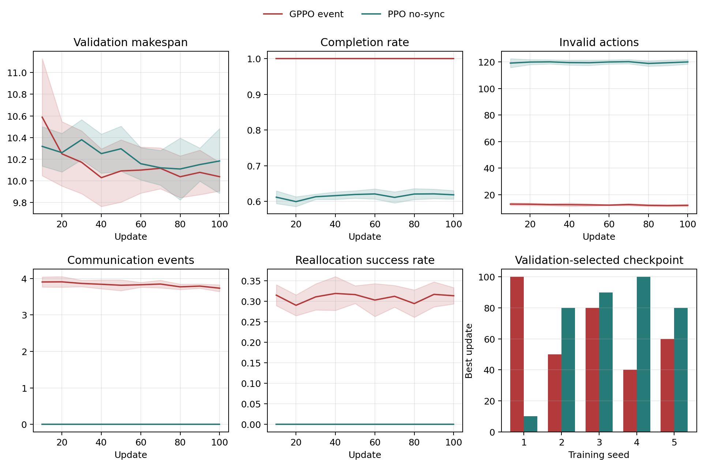
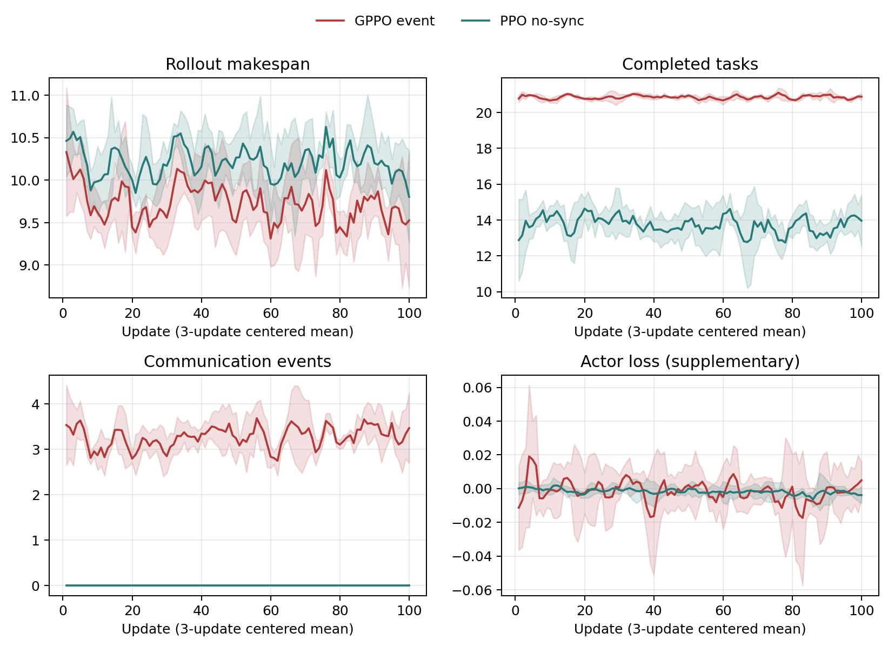

# GPPO-v1：弱通信条件下多无人机动态任务分配基线


> 本项目是对论文 *Multi-UAV Dynamic Task Assignment Based on Event-Triggered Graph Reinforcement Learning Under Weak Communication*（IEEE TASE, 2025）的独立方法级、结构级复现。

## 项目状态

| 项目 | 当前状态 |
| --- | --- |
| GPPO-v1 方法结构 | 已完成 |
| `100 updates × 16 episodes × 5 seeds` 稳定性复核 | 已完成 |
| GPPO/PPO 多规模公平对照 | 已完成 |
| Random / earliest-estimated-completion Greedy 对照 | 已完成 |
| 弱通信、事件同步与失效重分配 | 已完成 |
| 原论文绝对数值复现 | 未完成，原始代码和环境未公开 |
| PCRL 与世界模型 | 不属于本 v1 baseline |

当前最准确的结论是：

> GPPO-v1 已达到“可验收的工程研究基线”标准，可以作为后续算法改造的固定对照；但它不是原论文完整环境和实验表格的数值级复现。

## 快速导航

- 想理解复现逻辑：阅读“复现边界”“算法流程”和“环境与模型输入”；
- 想运行代码：阅读“安装与测试”“训练示例”和“评测示例”；
- 想核对结论：阅读“稳定性结果”“收敛判断”和 `artifacts/summary/` 原始汇总；
- 想继续研究：先查看“已知限制”，再决定是否进入 PCRL 改造。

## 1. 项目背景

本项目研究弱通信环境中的异构多无人机动态任务分配。每个任务由 Search、Reconnaissance、Strike、Recovery 四类阶段构成，并具有前序依赖。不同 UAV 具有不同的位置、飞行速度、健康状态、通信质量和四维任务能力。

算法需要解决：

- 哪架 UAV 执行哪个任务；
- UAV 何时开始和完成任务；
- 前序任务完成后如何解锁后继任务；
- 天气变化、UAV 失效、通信中断和新任务出现后如何重新分配；
- 在通信受限的情况下，如何降低总体最大完成时间 makespan。

## 2. 复现边界

原论文没有公开完整环境、任务实例生成器、通信模拟器和训练代码。因此，本仓库复现的是论文公开描述的公式和主要机制，包括：

- UAV/任务异构图；
- UAV-任务能力关系和任务前序关系；
- 图注意力特征提取；
- 动态 `(UAV, task)` 动作掩码；
- 事件驱动异步任务执行；
- makespan 差分奖励；
- 弱通信状态缓存；
- leader-follower、heartbeat、事件同步和失效重分配；
- 基于 PPO 的策略优化。

本仓库不声称：

- 复现论文表格中的绝对数值；
- 当前仿真器等价于论文私有环境；
- GPPO 已在所有规模上超过强启发式算法；
- 当前通信模型等价于真实无线链路。

## 3. 算法流程

```mermaid
flowchart LR
    A[生成异构 UAV 与任务链] --> B[构建 UAV-任务异构图]
    B --> C[形成弱通信 belief 状态]
    C --> D[分阶段图注意力编码]
    D --> E[动作掩码生成可行 UAV-任务对]
    E --> F[GPPO 选择任务分配动作]
    F --> G[任务进入异步执行状态]
    G --> H[时间推进到最近完成事件]
    H --> I[完成任务并解锁后继任务]
    I --> J[处理天气/失效/通信/新任务事件]
    J --> K[事件触发同步与任务重分配]
    K --> L[更新全部任务预计 makespan]
    L --> M[R_t = M_(t-1) - M_t]
    M --> C
```

## 4. 环境与模型输入

模型固定支持最多 6 架 UAV 和 36 个任务。较小规模使用 padding，因此同一个网络可以评测多个规模。

一次策略输入包括：

| 输入 | 形状 | 含义 |
| --- | ---: | --- |
| `nodes` | `42 × 24` | 6 个 UAV 节点和 36 个任务节点 |
| `edge_types` | `42 × 42` | 自连接、通信、任务前序和 UAV-任务关系 |
| `edge_features` | `42 × 42 × 5` | 飞行时间、执行时间、能力、通信质量和依赖状态 |
| `action_mask` | `217` | 216 个 UAV-任务动作和 1 个 no-op 动作 |

GPPO-v1 接收结构化数值状态，不接收图像、视频或 YOLO Bounding Box。视觉检测和世界模型不在本 baseline 范围内。

### UAV 状态

UAV 节点包含：

- 二维位置；
- 四维任务能力；
- 飞行速度；
- 健康状态；
- 通信质量；
- 空闲/忙碌状态；
- 剩余执行时间和累计处理时间；
- leader 标志和 heartbeat 新鲜度。

四维能力对应：

```text
[Search, Reconnaissance, Strike, Recovery]
```

### 任务状态

任务节点包含：

- 任务类型和位置；
- 工作量、优先级和风险；
- 前序任务；
- 是否已解锁、已分配或已完成；
- 开始时间、处理时间、预计完成时间和真实完成时间。

任务链默认按照以下顺序生成：

```text
Search → Reconnaissance → Strike → Recovery
```

## 5. 执行时间与异步调度

任务处理时间由飞行时间和执行时间组成：

```text
flight_time = distance(UAV, task) / UAV_speed

execution_time =
    (1 + 0.8 × weather_severity)
    × task_workload
    / UAV_capability[task_type]

processing_time = flight_time + execution_time
```

分配动作只让任务进入执行状态，不会立即将任务标记为完成。环境在没有更多可立即分配的动作时，将时间推进到最近的任务完成事件。只有前序任务真实完成后，后继任务才会解锁。

## 6. 动作空间与动作掩码

每个动作表示：

```text
将一个空闲 UAV 分配给一个可执行任务
```

动作只有在以下条件全部满足时才合法：

- UAV 已激活、存活且空闲；
- UAV 能力达到任务门槛；
- 任务处于激活状态；
- 任务尚未完成、尚未被其他 UAV 分配；
- 任务前序约束已经满足。

只有当前不存在合法分配时，no-op 动作才被开放。

## 7. makespan 奖励

主奖励严格使用：

```text
R_t = M_(t-1) - M_t
```

`M_t` 是当前全部 active task 的最大预计完成时间。估计同时覆盖：

- 已完成任务；
- 正在执行任务；
- 尚未分配任务；
- 尚未解锁但存在前序依赖的任务。

正式基线默认不将非法动作、通信成本和终局惩罚混入论文主奖励。

## 8. 弱通信与动态事件

环境维护两套状态：

```text
truth  = 真实物理状态
belief = 策略当前持有的通信缓存
```

策略只观察 belief。未同步时，belief 可能不知道其他 UAV 已失效、任务已变化或天气已改变。如果 belief 中合法的动作在 truth 中不合法，则记录一次 invalid action。

GPPO-v1 支持：

- `event`：关键事件发生后同步；
- `periodic`：每隔固定决策步同步；
- `always`：每个决策步都同步；
- `none`：不进行全局同步。

动态事件包括：

- 天气变化；
- UAV 失效；
- 新任务或任务变化；
- 通信质量下降。

正在执行任务的 UAV 失效后，任务会重新进入待分配状态；其他 UAV 接管并完成后，计为一次成功重分配。

## 9. GPPO 与基线方法

### GPPO

- 分阶段 UAV-node / task-node 图注意力；
- 使用连续 UAV-任务边特征；
- 事件触发同步；
- PPO clipping、GAE 和标量 critic。

### 普通 PPO

- 使用相同环境、奖励、训练规模、模型宽度和优化预算；
- 关闭图消息传递；
- 使用 no-sync 通信控制。

这是“图结构 + 事件同步”相对普通 PPO 的组合对照，不能将全部增益单独归因于图网络。

### Random

从当前动作掩码允许的动作中均匀采样。

### Earliest-estimated-completion Greedy

在所有合法 UAV-任务对中，选择预计完成时间最早的动作。

## 10. 正式稳定性复核协议

| 项目 | 配置 |
| --- | --- |
| 固定模型容量 | `6 UAV / 36 tasks` |
| 轮换训练规模 | `3x12, 4x20, 5x28` |
| 训练预算 | `100 updates × 16 episodes` |
| 训练种子 | `1, 2, 3, 4, 5` |
| 隐藏维度 | `64` |
| validation 间隔 | 每 10 updates |
| validation episodes | 每训练规模 20 episodes |
| validation seeds | 从 `40000` 开始 |
| 最终测试规模 | `2x8, 3x12, 4x20, 5x28, 6x36` |
| 最终测试场景 | 每规模 `50000..50099` 共 100 episodes |

每个学习方法的结果先在每个训练种子内对 100 个固定评测场景取均值，再以 5 个训练种子作为独立 replicate，计算 Student-t 95% 置信区间。

## 11. GPPO-v1 稳定性结果

### 11.1 Makespan 与完成率



仅比较 makespan 可能产生误导：一个策略如果留下更多未完成任务，也可能得到较短的表面 makespan。因此，本项目同时报告任务完成率。



下表为 `GPPO - PPO`。Makespan 越小越好，完成任务数越大越好。

| 规模 | Makespan delta ± 95% CI | Completed delta ± 95% CI | 结论 |
| --- | ---: | ---: | --- |
| `2x8` | `+0.096 ± 0.070` | `+0.932 ± 0.122` | GPPO makespan 显著更差 |
| `3x12` | `-0.551 ± 0.193` | `+1.770 ± 0.131` | GPPO 显著更好 |
| `4x20` | `-1.064 ± 0.232` | `+6.894 ± 0.368` | GPPO 显著更好 |
| `5x28` | `-1.179 ± 0.499` | `+10.202 ± 0.266` | GPPO 显著更好 |
| `6x36` | `-1.472 ± 0.177` | `+16.316 ± 0.742` | GPPO 显著更好 |

增加训练预算后，五个规模的优势方向与先前 `50 updates × 8 episodes` 实验完全一致。GPPO 相对 PPO 的多数规模优势具有可重复性。

### GPPO 绝对指标



| 规模 | Makespan | 完成任务数 | 通信次数 | 无效动作 | 重分配成功率 |
| --- | ---: | ---: | ---: | ---: | ---: |
| `2x8` | `7.002 ± .056` | `8.264 ± .011` | `1.060 ± .009` | `2.826 ± .193` | `1.000` |
| `3x12` | `6.920 ± .118` | `12.426 ± .007` | `1.546 ± .014` | `3.142 ± .082` | `1.000` |
| `4x20` | `9.217 ± .151` | `20.768 ± .020` | `3.370 ± .038` | `11.622 ± .406` | `1.000` |
| `5x28` | `10.363 ± .263` | `28.982 ± .010` | `3.998 ± .062` | `14.126 ± .708` | `.948` |
| `6x36` | `11.046 ± .245` | `36.000 ± 0` | `5.430 ± .105` | `18.296 ± .368` | `.986` |

### 与 Greedy 的对比

| 规模 | GPPO - Greedy makespan | 结论 |
| --- | ---: | --- |
| `2x8` | `+0.171 ± 0.056` | GPPO 显著更差 |
| `3x12` | `+0.035 ± 0.118` | 差异不显著 |
| `4x20` | `-0.411 ± 0.151` | GPPO 显著更好 |
| `5x28` | `-0.206 ± 0.263` | 均值更好，差异不显著 |
| `6x36` | `-0.293 ± 0.245` | GPPO 显著更好 |

负结果被完整保留：GPPO 没有在所有规模上超过 Greedy，小规模 `2x8` 仍明显不适合使用学习策略替代简单启发式。

## 12. 收敛判断



五个 GPPO 训练种子的 validation-selected best updates 为：

```text
[100, 50, 80, 40, 60]
```

五种子聚合诊断显示：

- validation makespan 晚期相对变化约 `-0.49% ± 1.77%`；
- makespan 晚期斜率的 95% CI 包含 0；
- completion rate 在中后期保持 `1.000`；
- invalid actions 的晚期斜率不显著为正。

因此 GPPO-v1 达到“基本收敛”标准，但不能声称所有训练种子都在 100 updates 前严格完全收敛。

<details>
<summary>展开查看训练阶段完整曲线</summary>



</details>

## 13. 安装与测试

建议使用 Python 3.10 或以上版本。

```powershell
python -m pip install -r requirements.txt
python -m pip install -e .
```

运行测试：

```powershell
$env:PYTEST_DISABLE_PLUGIN_AUTOLOAD='1'
python -m pytest -q
```

## 14. 训练示例

```powershell
$env:PYTHONPATH='src'

python train_paper_gppo.py `
  --algorithm gppo `
  --graph-mode staged `
  --sync-mode event `
  --seed 1 `
  --max-uavs 6 `
  --active-uavs 4 `
  --max-tasks 36 `
  --initial-tasks 24 `
  --train-scales 3x12 4x20 5x28 `
  --updates 100 `
  --episodes-per-update 16 `
  --max-decisions 180 `
  --hidden-dim 64 `
  --validation-episodes 20 `
  --validation-interval 10 `
  --validation-seed 40000 `
  --output outputs/gppo_v1/gppo/seed_1
```

普通 PPO 使用相同参数，只修改：

```text
--algorithm ppo
--graph-mode none
--sync-mode none
```

## 15. 评测示例

```powershell
python evaluate_paper_gppo.py `
  --checkpoint outputs/gppo_v1/gppo/seed_1/checkpoint.pt `
  --scales 2x8 3x12 4x20 5x28 6x36 `
  --episodes 100 `
  --eval-seed 50000 `
  --sync-mode event `
  --output outputs/gppo_v1_eval/gppo_event/seed_1
```

每个评测 episode 会记录：

- makespan；
- 完成任务数与完成率；
- 通信同步次数和 heartbeat 数；
- 无效动作数；
- 重分配任务数和成功率；
- 剩余任务、leader 更换次数和累计 return。

## 16. 仓库结构

```text
src/uav_assignment/
  paper_env.py             异步任务环境、弱通信和动态事件
  paper_models.py          GPPO 异构图 actor-critic

train_paper_gppo.py        GPPO/PPO 训练入口
evaluate_paper_gppo.py     学习方法及随机/贪心评测入口
summarize_paper_gppo.py    五种子均值、CI 和配对比较

tests/
  test_paper_env.py        图结构、异步执行、奖励和重分配测试

docs/
  GPPO_V1_REPRODUCTION.md  方法结构复现说明
  GPPO_V1_STABILITY_REVIEW.md  稳定性复核报告

artifacts/                 可选的 checkpoint、汇总数据和训练曲线
```

## 17. 已知限制

- 原论文环境和代码未公开，不能进行严格数值级复现；
- UAV 能力在 v1 中主要体现执行效率差异，硬能力不可达约束较弱；
- 通信指标是同步次数，不是实际带宽、字节数或网络时延；
- GPPO 与 PPO 主对照同时改变图消息和事件同步，不能单独归因；
- 无效动作虽然没有随训练持续恶化，但仍随任务规模增加；
- validation 曲线聚合了三个训练规模；
- 当前未记录 KL、clip fraction、value loss 和 gradient norm 等完整 PPO 诊断量；
- 当前结果不包含 PCRL、JEPA 或世界模型。

## 18. 阶段结论

GPPO-v1 已完成方法结构复现和五种子稳定性复核，并在 5 个评测规模中的 4 个规模上稳定优于普通 PPO。它可以作为后续研究的固定工程基线，但必须保留小规模不如 Greedy、通信模型简化和非论文数值复现等限制。

## 参考文献

```text
J. Yu, Y. Zhang, and C. Sun,
"Multi-UAV Dynamic Task Assignment Based on Event-Triggered Graph
Reinforcement Learning Under Weak Communication,"
IEEE Transactions on Automation Science and Engineering, vol. 22, 2025.
```
